# USER MANAGEMENT API

#### ENVIRONMENT ############

#### Java
    openjdk version "11.0.18" 2023-01-17
    OpenJDK Runtime Environment Homebrew (build 11.0.18+0)

### MAVEN
    Apache Maven 3.9.1
    
#### SPRING-BOOT
    Version 2.7.10

#### Docker setup
     ### Install Docker from docker hub:  https://docs.docker.com/
     ### Docker Registry : https://hub.docker.com/

#### Docker Compose is used for running multiple containers as a single service
     ### pre-requisites
          ### Dockerfile to be created under root of project
          #### docker-compose.yaml to be created under root of project 

#### Docker command to show your images

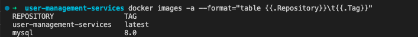

#### Docker command to list containers Images
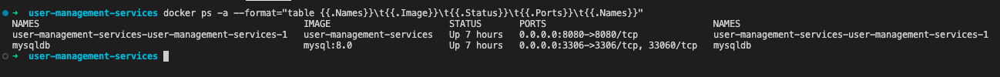 

     
### Local Docker Images created as per docker-compose.yaml
     Mysql
     user-management-services

   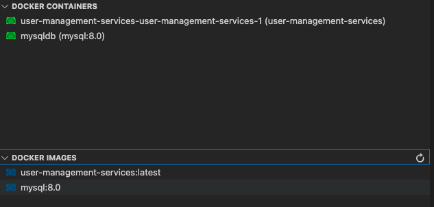
     

#### Spring Boot Applciation Build and Run process

 1. step 1:-  Navigate to root directory, where pom.xml exist and make sure Build is successfull and Test cases executed successfully.

  ### Location of pom.xml file

 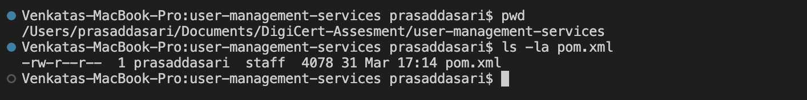

 2. Step 2:- Use maven commands to build and run your spring boot Application

        ### Maven Command to build your Application

     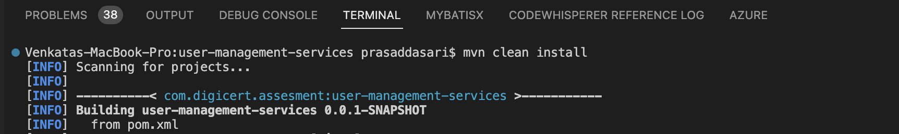

       #### Build Result of Spring Boot Application

     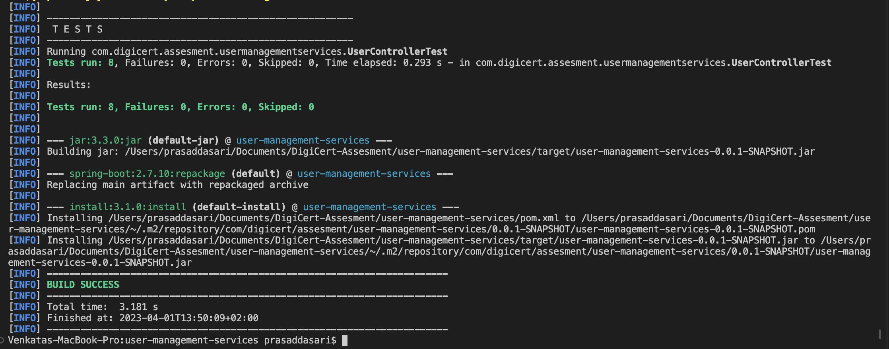

     #### Maven Command to run Spring boot Application

      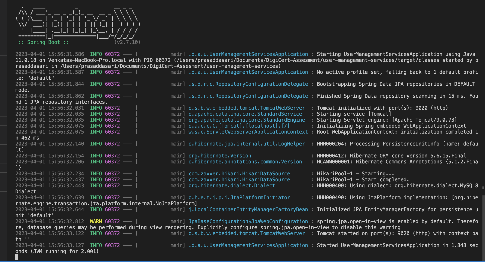

      #### Spring boot Application Status

       

    #### 2. #### Testing User Management API Locally 
         Install any API Testing Tools listed below.
         Postman (or) Insomnia
          1. Insomnia Tool
    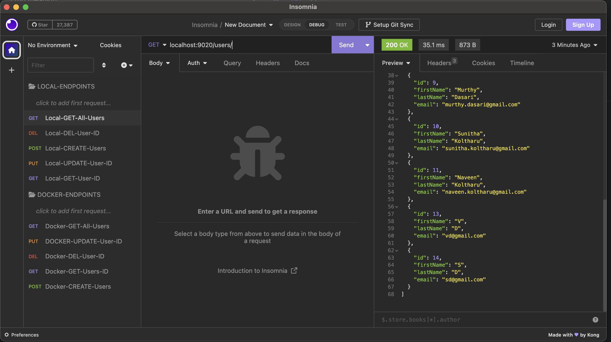

         Use Swagger endpoints
         url : http://localhost:9020/swagger-ui/index.html#

        2. Swagger Tool
       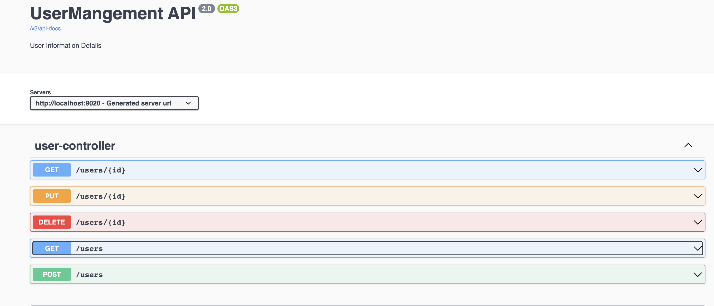

       ### Endpoint Test
       
    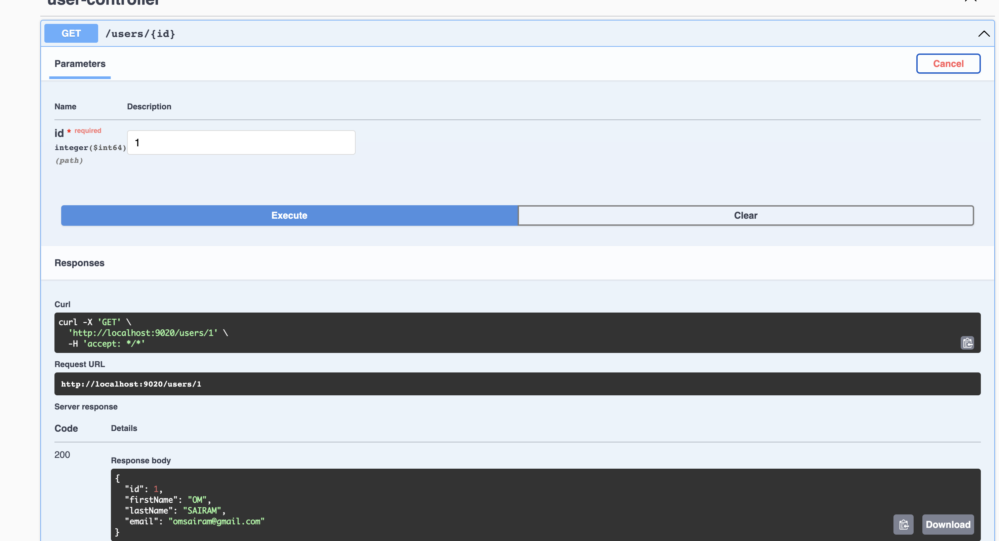

    ### MySQL DB Connection Details

    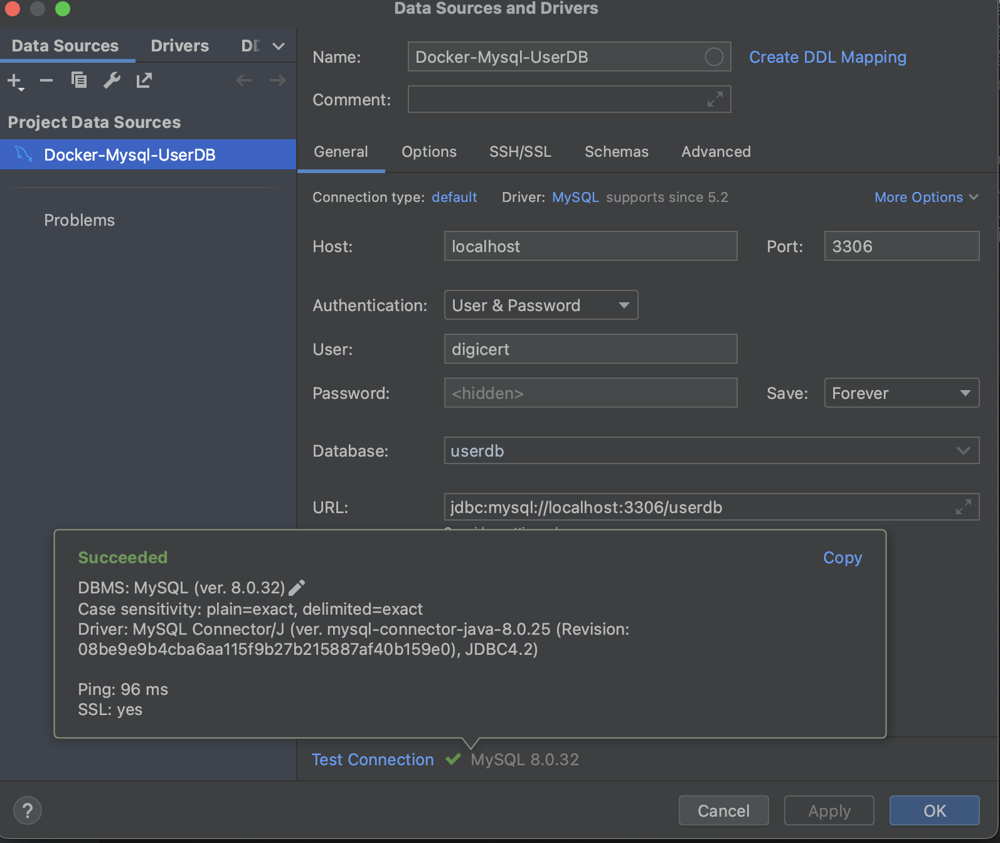

       ### MySQL DB Data Results

    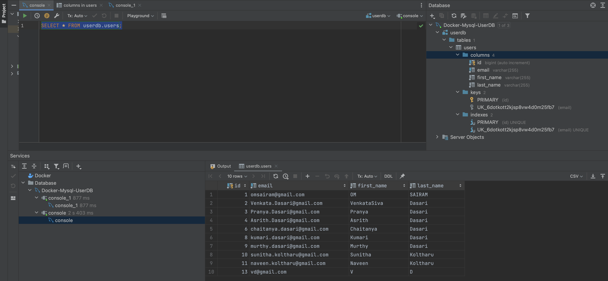

       ### Endpoints file in JSON format saved under root folder
         ### UserMgmtAPIEndpoints.json
       
      

  

       

          

  

  

